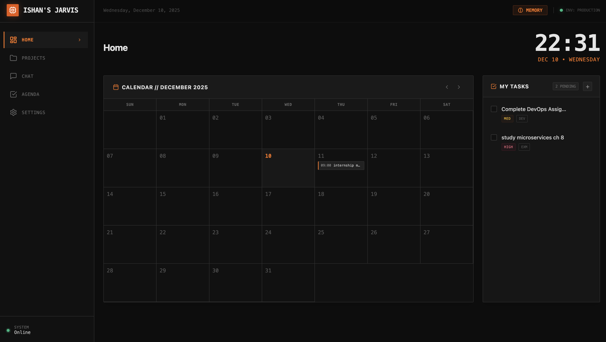
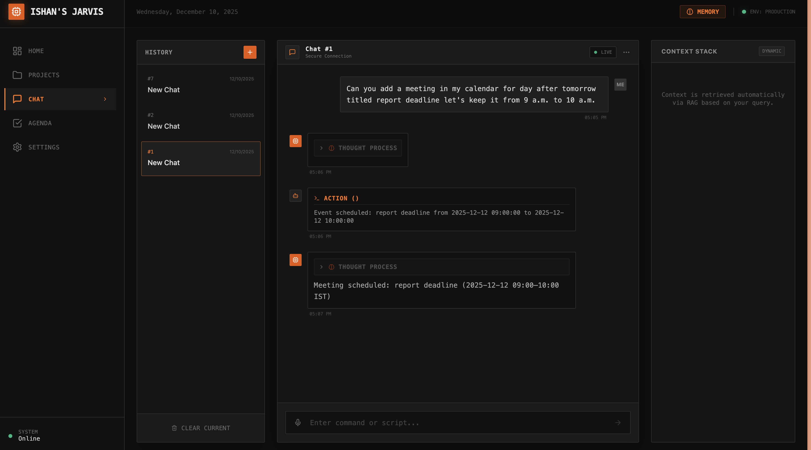
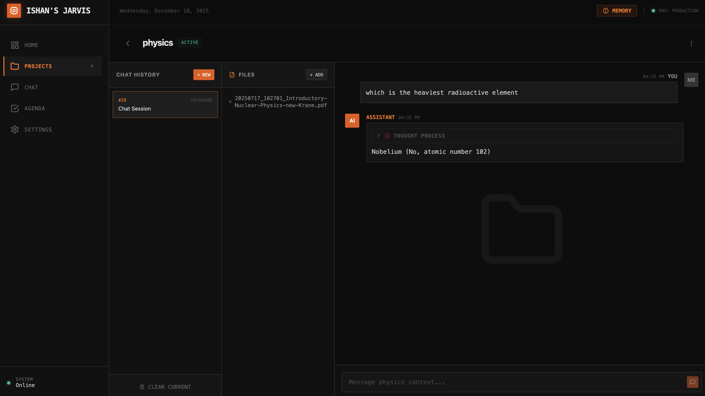
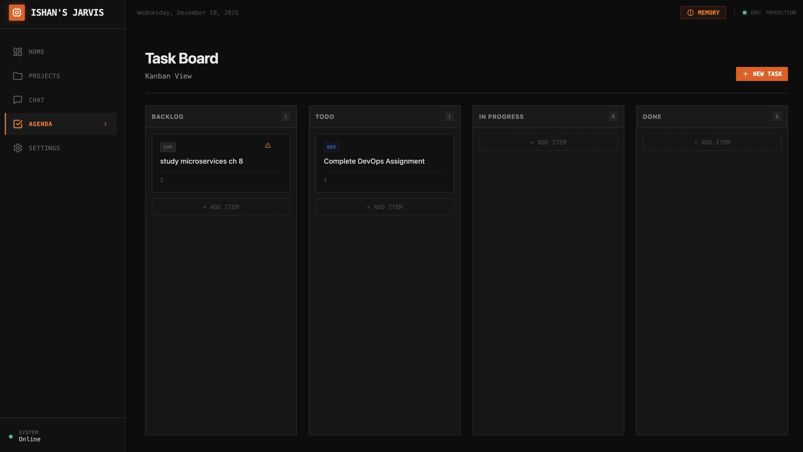
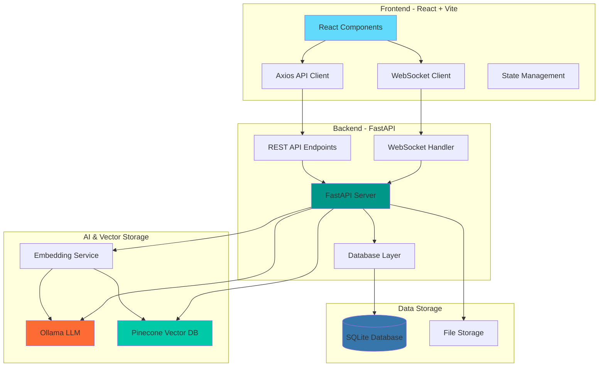
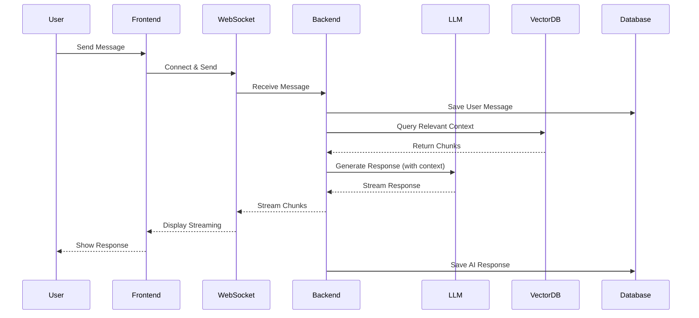

# Jarvis - Your Personal AI Assistant

<div align="center">


**Your intelligent, agentic AI companion for seamless personal workflow management.**

[Introduction](#introduction) • [Features](#features) • [Architecture](#architecture) • [Installation](#installation) • [Usage](#usage) • [Tech Stack](#tech-stack)

</div>

---

## Screenshots

### Dashboard



### Chat Interface



### Project Management



### Task Board



---

## Introduction

**Jarvis** is your **personal workflow management system** — an intelligent, AI-powered companion designed to help you manage your daily work seamlessly. 

In today's fast-paced world, productivity often gets fragmented across different tools: one app for tasks, another for notes, yet another for scheduling, and separate tools for AI assistance. Jarvis unifies all of these into a **single, cohesive experience** that understands you and adapts to your workflow.

### What Makes Jarvis Different?

**Agentic AI** — Unlike passive chatbots, Jarvis is an **autonomous agent** that can take real actions on your behalf. Ask it to "create a task for tomorrow's meeting prep" or "add a calendar event for Friday at 3 PM" and it will **automatically create and manage** tasks and calendar events for you.

**Unified Workspace** — Bring together your **projects**, **tasks**, **calendar events**, and **documents** in one place. Each project has its own chat context, file storage, and task board — everything you need, exactly where you need it.

**Voice-First Interaction** — Speak naturally to Jarvis using **OpenAI Whisper** integration. Just click and talk — no typing required. Perfect for quick task creation, asking questions, or when your hands are busy.

**Contextual Intelligence** — Through **RAG (Retrieval-Augmented Generation)**, Jarvis can answer questions using your uploaded documents. Upload meeting notes, research papers, or code files, and Jarvis becomes an expert on YOUR content.

**Memory That Persists** — Jarvis remembers your preferences, past conversations, and important context across sessions. It learns how you work and adapts accordingly.

---

## Features

### Intelligent AI Chat
- **Local LLM Integration** - Powered by Ollama (Qwen 3:4b model)
- **Streaming Responses** - Real-time message streaming with WebSocket
- **Context-Aware** - Remembers conversation history across sessions
- **Voice Chat** - Speak naturally using **OpenAI Whisper** transcription — just click and talk!
- **Thought Process Visualization** - View AI reasoning in collapsible sections

### Agentic AI Capabilities
- **Task Creation & Editing** - Ask AI to create, update, or complete tasks using natural language
- **Calendar Event Management** - Add, modify, or query calendar events through conversation
- **Autonomous Actions** - AI can take real actions on your behalf, not just provide information
- **Tool Calling** - Integrated tool system for seamless task and calendar automation
- **Smart Scheduling** - Tell Jarvis "Schedule a meeting for tomorrow at 2 PM" and it handles the rest

### Project Management
- **Multi-Project Support** - Organize work across different projects
- **File Upload & Processing** - Supports PDF, DOCX, text, and code files
- **RAG (Retrieval Augmented Generation)** - AI answers questions using your uploaded files
- **Project-Specific Chats** - Isolated chat sessions with project context
- **Smart Embeddings** - Automatic file chunking and vector storage

### Task & Calendar Management
- **Kanban Board** - Drag-and-drop task management (Todo → In Progress → Done)
- **Priority Levels** - Organize tasks by priority (Low, Medium, High)
- **Task Tags** - Categorize with custom tags (DEV, BUG, GEN, etc.)
- **Calendar Integration** - Schedule events and link them to tasks
- **AI Task Creation** - Ask AI to create tasks via natural language

### Memory System
- **Persistent Memory** - Store user preferences and important context
- **Category-Based** - Organize memories by categories
- **Context Injection** - Memories are automatically included in AI prompts

### Modern UI/UX
- **Dark Theme** - Eye-friendly dark interface with orange accents
- **Responsive Design** - Works on desktop and mobile
- **Real-Time Updates** - Live status indicators and notifications
- **Smooth Animations** - Polished transitions and interactions

---

## Architecture



### Data Flow



---

## Tech Stack

### **Backend**
| Technology | Version | Purpose |
|------------|---------|---------|
| **Python** | 3.13 | Core language |
| **FastAPI** | 0.115 | REST API & WebSocket server |
| **SQLAlchemy** | 2.0 | Async ORM for database |
| **Ollama** | 0.4.4 | Local LLM integration |
| **Pinecone** | 5.0 | Vector database for RAG |
| **SQLite** | 3.x | Lightweight database |
| **PyPDF** | 5.1 | PDF processing |
| **python-docx** | 1.1 | DOCX processing |
| **Uvicorn** | 0.32 | ASGI server |

### **Frontend**
| Technology | Version | Purpose |
|------------|---------|---------|
| **React** | 18 | UI library |
| **Vite** | 5 | Build tool & dev server |
| **Axios** | 1.6 | HTTP client |
| **Tailwind CSS** | 3.3 | Utility-first CSS |
| **Lucide React** | 0.294 | Icon library |
| **date-fns** | 2.30 | Date utilities |

### **AI & ML**
- **Qwen 3:4b** - Main language model
- **nomic-embed-text** - 768-dimensional embeddings
- **OpenAI Whisper** - Voice transcription for voice chat
- **RAG Pipeline** - Custom chunking (500 chars, 50 overlap)
- **Agentic Tools** - Task and calendar management automation

---

## Installation

### Prerequisites

Before you begin, ensure you have the following installed:

- **Python 3.13+** - [Download](https://www.python.org/downloads/)
- **Node.js 18+** - [Download](https://nodejs.org/)
- **Ollama** - [Download](https://ollama.ai/)
- **Git** - [Download](https://git-scm.com/)

### Step 1: Clone the Repository

```bash
git clone https://github.com/ishangtxl/Ishan-s-Jarvis.git
cd Ishan-s-Jarvis
```

### Step 2: Set Up Ollama Models

Install the required Ollama models:

```bash
# Pull the main LLM model
ollama pull qwen3:4b

# Pull the embedding model
ollama pull nomic-embed-text

# Verify Ollama is running
ollama serve
```

### Step 3: Backend Setup

```bash
# Navigate to backend directory
cd backend

# Create virtual environment
python -m venv venv

# Activate virtual environment
# On macOS/Linux:
source venv/bin/activate
# On Windows:
venv\Scripts\activate

# Install dependencies
pip install -r requirements.txt

# Create .env file
cat > .env << EOF
PINECONE_API_KEY=your_pinecone_api_key_here
PINECONE_ENVIRONMENT=us-east-1
PINECONE_INDEX_NAME=jarvis-memory
OLLAMA_BASE_URL=http://localhost:11434
LLM_MODEL=qwen3:4b
EMBEDDING_MODEL=nomic-embed-text
EOF
```

**Note:** Get your Pinecone API key from [Pinecone Console](https://app.pinecone.io/)

### Step 4: Frontend Setup

```bash
# Navigate to frontend directory
cd ../frontend

# Install dependencies
npm install

# Create necessary directories
mkdir -p ../data/uploads
```

---

## Usage

### Starting the Application

#### Terminal 1 - Start Backend Server
```bash
cd backend
source venv/bin/activate  # On Windows: venv\Scripts\activate
uvicorn app.main:app --reload --host 0.0.0.0 --port 8000
```

Backend will be available at: `http://localhost:8000`

#### Terminal 2 - Start Frontend Dev Server
```bash
cd frontend
npm run dev
```

Frontend will be available at: `http://localhost:5173`

### First Time Setup

1. **Open the Application** - Navigate to `http://localhost:5173`
2. **Add Memory** - Click the "Memory" button to add preferences
3. **Create a Project** - Go to Projects tab and create your first project
4. **Upload Files** - Add documents to your project for RAG
5. **Start Chatting** - Ask questions about your files!

---

## API Documentation

Once the backend is running, access the interactive API docs:

- **Swagger UI**: `http://localhost:8000/docs`
- **ReDoc**: `http://localhost:8000/redoc`
- **Health Check**: `http://localhost:8000/health`

---

## Use Cases

### For Developers
- **Code Documentation** - Upload code files and ask questions
- **Project Context** - Keep track of multiple projects
- **Task Management** - Organize development tasks on Kanban board
- **API Reference** - Upload API docs and query them naturally

### For Students
- **Research Assistant** - Upload papers and get summaries
- **Study Notes** - Store and query course materials
- **Assignment Tracking** - Manage deadlines with calendar

### For Professionals
- **Meeting Notes** - Store meeting minutes and retrieve context
- **Document Search** - Find information across multiple documents
- **Project Planning** - Track tasks and milestones
- **Knowledge Base** - Build a personal knowledge repository

---

## Configuration

### Environment Variables

| Variable | Description | Default |
|----------|-------------|---------|
| `PINECONE_API_KEY` | Pinecone API key | Required |
| `PINECONE_ENVIRONMENT` | Pinecone region | `us-east-1` |
| `PINECONE_INDEX_NAME` | Index name | `jarvis-memory` |
| `OLLAMA_BASE_URL` | Ollama API URL | `http://localhost:11434` |
| `LLM_MODEL` | LLM model to use | `qwen3:4b` |
| `EMBEDDING_MODEL` | Embedding model | `nomic-embed-text` |

### Database Location

- SQLite database: `data/jarvis.db`
- Uploaded files: `data/uploads/`

---

## Troubleshooting

### Backend Issues

**Error: Ollama connection failed**
```bash
# Ensure Ollama is running
ollama serve

# Check if models are installed
ollama list
```

**Error: Database locked**
```bash
# Close all connections and restart
rm data/jarvis.db  # Warning: This deletes all data!
# Restart the backend
```

### Frontend Issues

**Error: Cannot connect to backend**
- Ensure backend is running on port 8000
- Check if CORS is properly configured
- Verify Vite proxy settings in `vite.config.js`

**Error: WebSocket connection failed**
- Backend must be running
- Check browser console for detailed errors
- Verify WebSocket endpoint: `ws://localhost:5173/api/chat/ws/{session_id}`

---

## Contributing

Contributions are welcome! Please feel free to submit a Pull Request.

---

## License

This project is licensed under the MIT License - see the [LICENSE](LICENSE) file for details.

---

## About

This project was developed as part of the **Diligent Internship Exercise** to demonstrate:
- Full-stack development capabilities
- AI/ML integration with RAG
- Modern web technologies
- System architecture design
- Clean code practices

**Developer**: [Ishan Gupta](https://github.com/ishangtxl)

---

<div align="center">

**Built with FastAPI, React, and Ollama**

[Back to Top](#jarvis---your-personal-ai-assistant)

</div>
